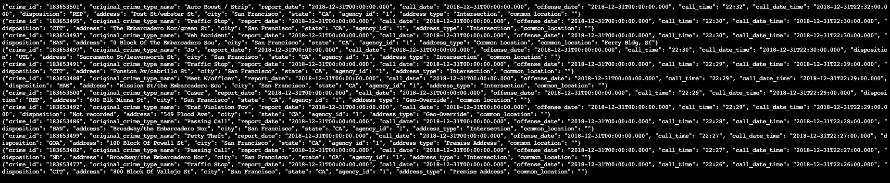
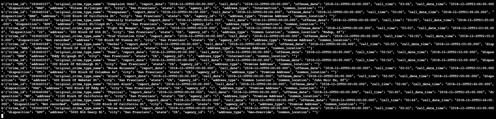
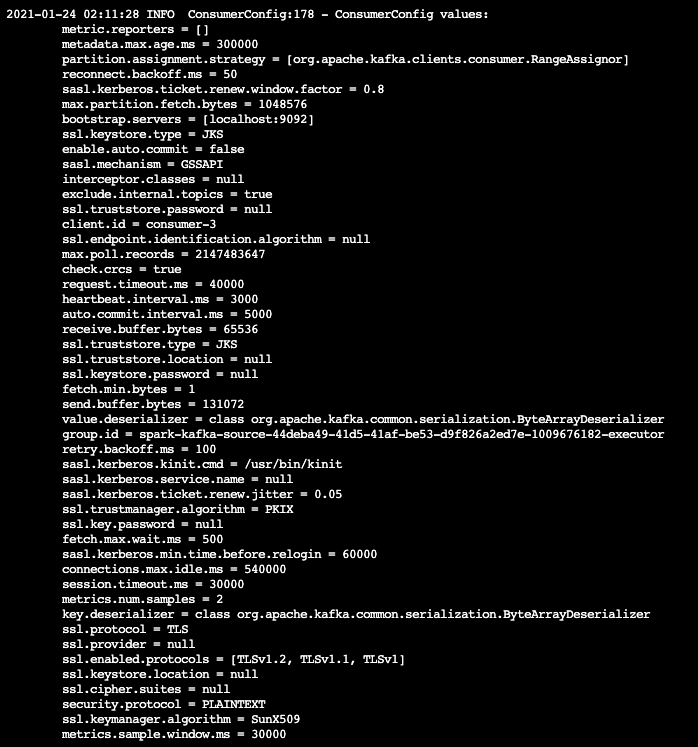
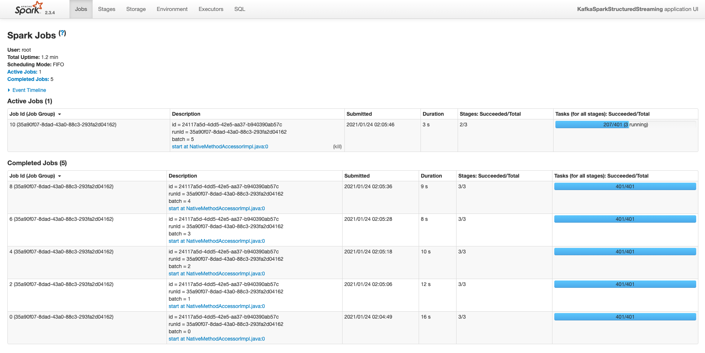

# San Francisco Crime Statistics with Spark Streaming

This is the final project developed for **Data Streaming Nanodegree Program**. The task here is to connect *Spark* to *Kafka* in order to analyse San Francisco crime streaming data from Kaggle.

# Steps To Run This Project

> **_NOTE:_**  Data files are not available in this repository but you can google them

1. Run `make install`, this is for installing project dependencies with *conda* so you need to [install conda](https://docs.conda.io/projects/conda/en/latest/user-guide/install/) for succesfully running it.
2. Start *Zookeper* with `make start_zookeeper`
3. Start *Kafka* server with `make start_kafka_server`
4. Run `python kafka_server.py` for produce data to the principal Kafka topic. If you want to check the correctness of this command you can check it with `make check_kafka_topic`

# Answer To Udacity's Questions

This section is just for the Udacity's reviewers, but you can also use them for check if you are running it correctly :stuck_out_tongue_winking_eye:.

## Step 1

Example of `kafka-console-consumer` output:

## Step 2

Example of `python consumer_server.py` output:

Let's see the different example outputs after running spark application with: `spark-submit --conf spark.ui.port=3000 --packages org.apache.spark:spark-sql-kafka-0-10_2.11:2.3.4 --master local[*] data_stream.py`

Example of metrics reporter output:

Example of Spark UI output:

## Step 3

1. How did changing values on the SparkSession property parameters affect the throughput and latency of the data?

In spark you can change a lot of different properties for improving your performance, let's list some examples:

    - `spark.executor.instances`: With this property you can set the number of executors you will use for that app
    - `spark.executor.memory`: With this property you can set the memory for each Spark executor
    - `maxOffsetsPerTrigger`: With this property you can set the rate limit on maximum number of offsets processed per trigger interval
    - `maxRatePerPartition`: With this property you can set the maximum number of messages per partition per batch

2. What were the 2-3 most efficient SparkSession property key/value pairs? Through testing multiple variations on values, how can you tell these were the most optimal?

This is really depending on your cluster size, your use case and your application stuff but having the tests I already ran I would say:

> maxRatePerPartition = 10, maxOffsetsPerTrigger = 200

# Acknowledgements

Thanks [Udacity](https://www.udacity.com/) for all the learnings you teach us in this nanodegree program! :raised_hands:.
